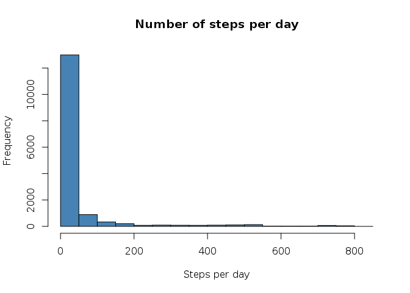
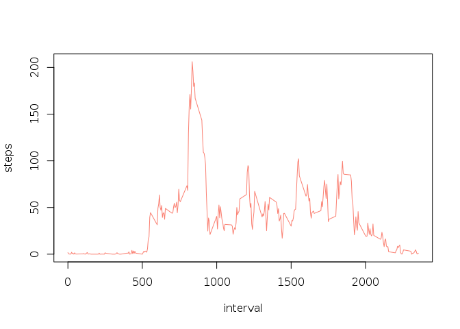
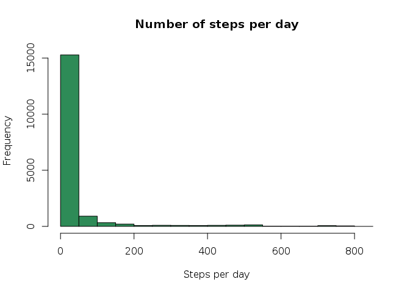
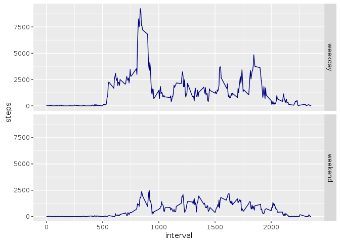

# Reproducible Research: Peer Assessment 1


## Loading and preprocessing the data

```r
library(dplyr, warn.conflicts = FALSE)
act <- tbl_df(read.csv(unzip('activity.zip')))
```

## What is mean total number of steps taken per day?

```r
hist(act$steps, xlab = 'Steps per day', main = 'Number of steps per day', col = 'steelblue')
```

<!-- -->

```r
meansteps <- mean(act$steps, na.rm = TRUE)
mediansteps <- median(act$steps, na.rm = TRUE)
```
**Mean** steps taken per day: 37.3825996  
**Median** steps taken per day: 0

## What is the average daily activity pattern?

```r
msteps <- aggregate(steps ~ interval, data = act, mean)
plot(msteps, type = 'l', col = 'salmon')
```

<!-- -->

```r
maxint <- msteps$interval[which.max(msteps$steps)]
```
The 5-minute interval which contains the maximum number of steps is the 835

## Imputing missing values

```r
numna <- sum(is.na(act$steps))
impute.median <- function(x) replace(x, is.na(x), median(x, na.rm = TRUE))
actrm <- act %>% group_by(interval) %>% mutate(steps = impute.median(steps))
hist(actrm$steps, xlab = 'Steps per day', main = 'Number of steps per day', col = "seagreen")
```

<!-- -->

```r
meansteps <- mean(actrm$steps, na.rm = TRUE)
mediansteps <- median(actrm$steps, na.rm = TRUE)
```
**Mean** steps taken per day: 32.9995446  
**Median** steps taken per day: 0

These values differ from the first part of the assignment.  
Imputing missing values decreases the total daily number of steps.

## Are there differences in activity patterns between weekdays and weekends?

```r
library(ggplot2)
actrm <- actrm %>% 
  mutate(weekday = ifelse(substr(weekdays(as.Date(date), abbreviate = TRUE), 1, 1) == 'S', 'weekend', 'weekday'))
msteps <- actrm %>% group_by(interval, weekday) %>% summarise(steps = sum(steps))
ggplot(msteps, aes(y = steps, x = interval)) + facet_grid(weekday ~ .) + geom_line(col = 'navyblue')
```

<!-- -->
